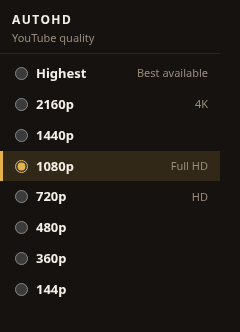

# AutoHD for YouTube

A tiny Chrome extension that keeps YouTube videos at the quality you pick.

Open the popup, choose a quality, and every YouTube watch page uses that setting. No account, no cloud, no extra sites.



**This extension only runs on `youtube.com`.** It cannot read or change any other website.

## Quality options

- Highest available
- 2160p (4K)
- 1440p
- 1080p (default)
- 720p
- 480p
- 360p
- 144p

If a video does not offer your choice, AutoHD selects the next-best available quality at or below it. Ads and homepage hover previews are left alone.

## Install in Chrome

The project is unpacked source. You load it locally:

1. Clone this repository.
2. Open `chrome://extensions`.
3. Turn on **Developer mode**.
4. Click **Load unpacked**.
5. Select this folder (the one that contains `manifest.json`).

Pin AutoHD from the puzzle-piece menu, then click it and pick a quality.

## Permissions

| Permission | Why |
| --- | --- |
| `storage` | Saves your quality choice in Chrome sync storage. |
| Content scripts on `https://www.youtube.com/*`, `https://youtube.com/*`, `https://m.youtube.com/*` | Applies that choice to the YouTube player. |

There is no `tabs`, `<all_urls>`, cookies, webRequest, or background network access.

## Privacy

- No analytics, telemetry, or crash reporting.
- No remote code.
- No requests to third-party servers.
- Your preference stays in `chrome.storage.sync` on your Google account / machine.
- Content scripts are not injected into YouTube embeds on other sites.

## How it works

1. The popup writes the selected quality with the promise-based `storage.sync` API (`browser` in Chrome 148+, `chrome` before that).
2. An [isolated-world](https://developer.chrome.com/docs/extensions/develop/concepts/content-scripts#isolated_world) content script copies that value onto `youtube.com` pages.
3. A [MAIN-world](https://developer.chrome.com/docs/extensions/develop/concepts/content-scripts) script talks to YouTube’s player (`setPlaybackQualityRange`) so the setting actually sticks.
4. It re-applies on play, quality drift, and YouTube’s in-page navigation.

Requires **Chrome 120+**. Manifest V3, no service worker, no remote code.

## Development

No build step and no npm install. The extension uses Manifest V3 APIs from current [Chrome extension docs](https://developer.chrome.com/docs/extensions): promise `storage.sync`, static `content_scripts` with `world: "MAIN"`, and the `browser` namespace with a `chrome` fallback.

```bash
node --test
node test/e2e-cdp.mjs
python3 scripts/make-icons.py
```

`test/e2e-cdp.mjs` launches a throwaway Chrome profile over the DevTools Protocol pipe (`--remote-debugging-pipe` + `--enable-unsafe-extension-debugging`), loads this unpacked extension with [`Extensions.loadUnpacked`](https://chromedevtools.github.io/devtools-protocol/tot/Extensions/#method-loadUnpacked), then checks:

- no injection on `example.com` / `github.com`
- default 1080p on `youtube.com`
- popup clicks persist through `chrome.storage` to the YouTube page
- YouTube embeds on other sites stay untouched
- a real watch page reports 1080p

Needs Chrome 137+ (`google-chrome-stable` or set `CHROME_PATH`). Use `E2E_HEADED=1` to show the window.

Then reload the extension on `chrome://extensions`.

## Limits

YouTube still decides which renditions exist for a given video (Premium, live streams, device, and connection can all cap quality). This extension cannot create a 1080p stream that YouTube does not offer.

YouTube Music, Studio, and `youtu.be` redirect landing pages are out of scope on purpose.

## License

[MIT](LICENSE)

Not affiliated with YouTube or Google.
